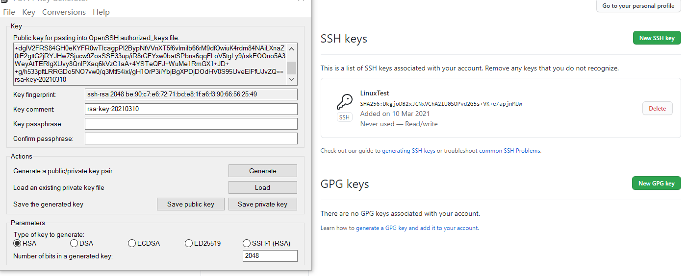
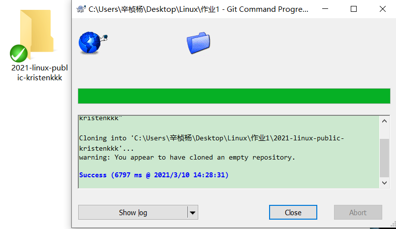
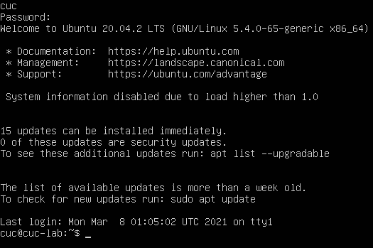
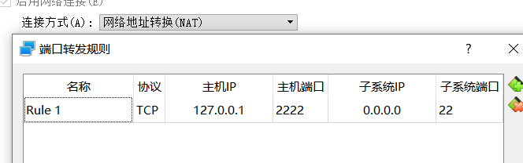
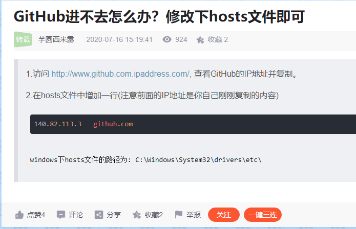
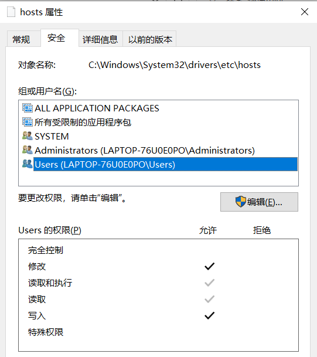

# Linux系统与网络管理
## *实验一 安装过程自动化(无人值守)*

*19信息安全1班 2019302120100   辛桢杨*

---

### 一、实验正式开前的部分准备 如下图所示：

公私钥的生成与配置

Clon仓库成功

---

### 二、开始实验

#### 1、下载好老师提供的Ubuntu 20.04文件，并导入到虚拟机VirtualBox中

#### 2、cuc登录
虽然密码输入没有显示，但是实际上是输入了cuc密码再按回车了的

#### 3、获取IP地址
输入 ip a 回车

#### 4、输入man man回车命令

#### 5、man 3 printf

#### 6、NAT网络配置
按照老师的说明配置了

#### 7、连接虚拟机
输入 cuc@127.0.0.1 -p 2222回车
问题~：结果显示 command not found

---

### 三、实验中遇到的问题以及解决方法

#### 1、github网页打不开（其他网页能正常打开）

但是，修改host文件我又遇到了权限问题，我通过百度解决了

最终github能正常访问了

#### 2、下载好的虚拟机无法导入
由于是第一周遇到的问题，我完成本次实验时已经是第二周了，故没有截图
其他同学也遇到了同样的问题，并在微信群、语雀上询问了老师并解决了问题，我查看了解决办法
——下载并安装virtualbox extension
——添加host-only网卡

#### 3、连接虚拟机老是失败
cuc@127.0.0.1: command not found