# Linux系统与网络管理-实验报告
## 实验一 安装过程自动化(无人值守)

*19信息安全1班 2019302120100   辛桢杨*

---

### 一、实验正式开前的部分准备 如下图所示：

公私钥的生成与配置
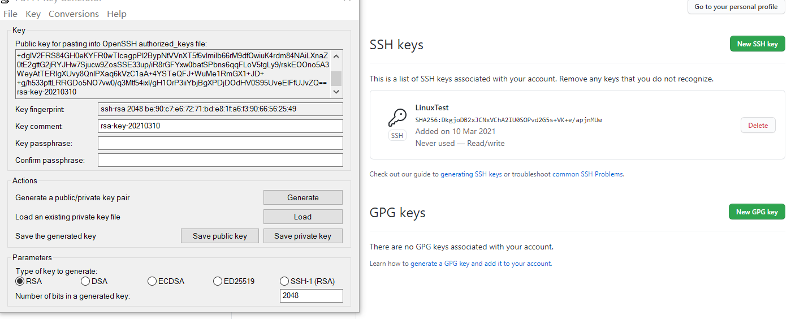

Clon仓库成功
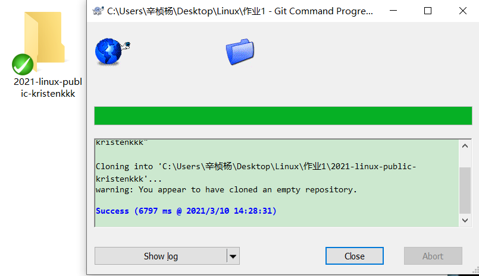

---

### 二、开始实验

#### ①手动安装

#### 1、下载好老师提供的镜像文件ubuntu-20.04.2-live-server-amd64.iso

#### 2、新建虚拟机，并创建好双网卡
（1）
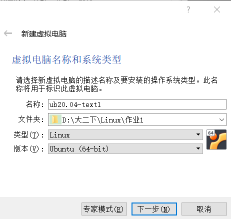
...一直默认选项
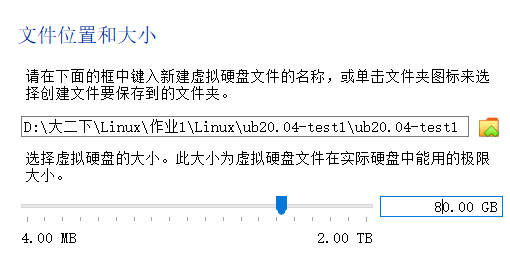
...一直默认选项
虚拟机创建完毕

（2）
设置两块网卡，一块是NAT，另一块是Host-Only
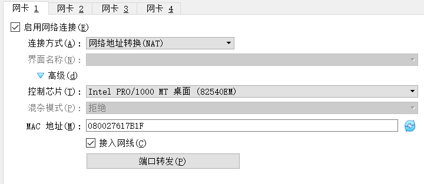
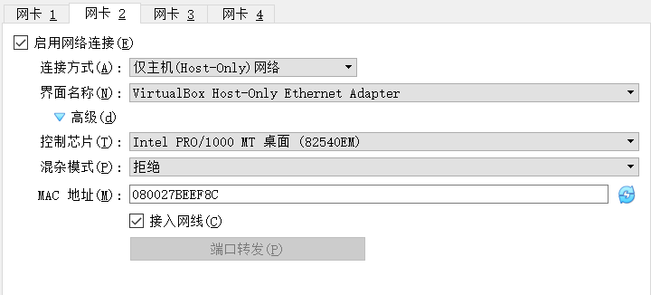

#### 3、启动虚拟机，开始安装iso
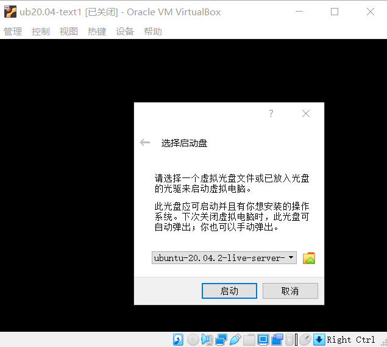
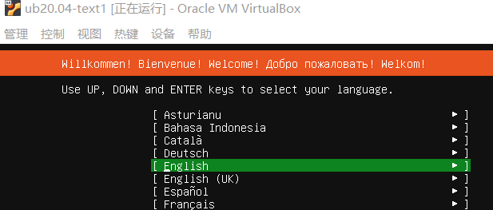
...一直默认选项
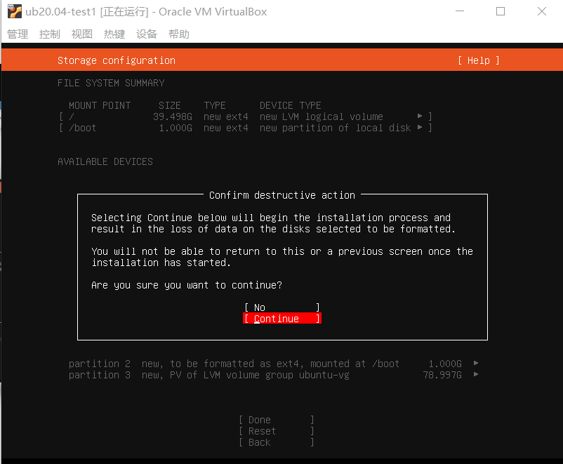
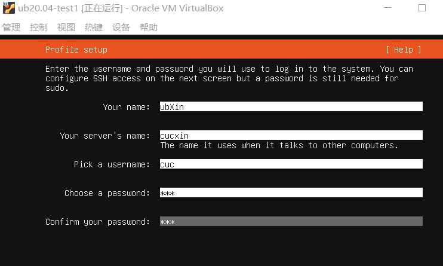
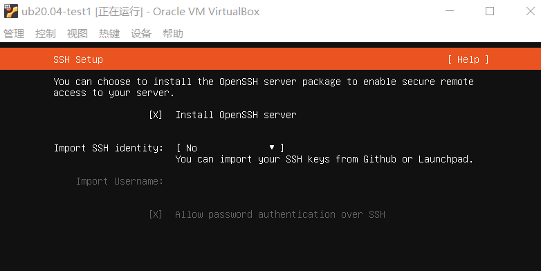
...一直默认选项
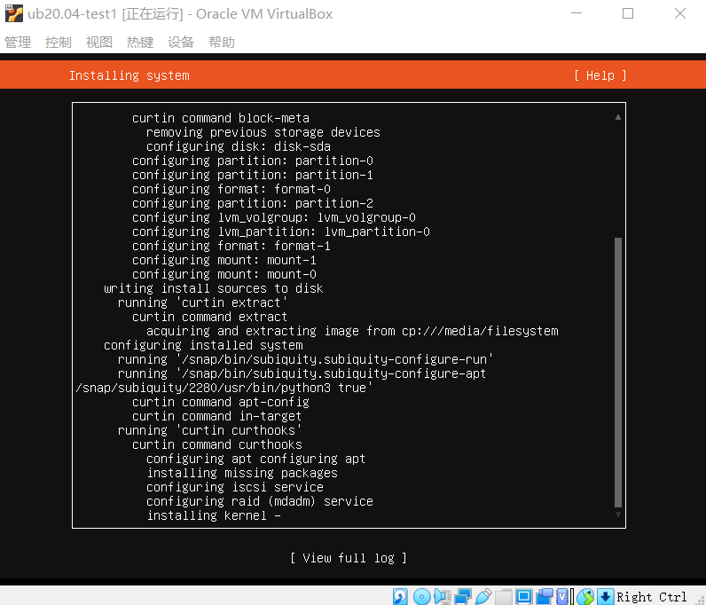

。。。。。。经过一段漫长的时间，终于安装成功了，如下图
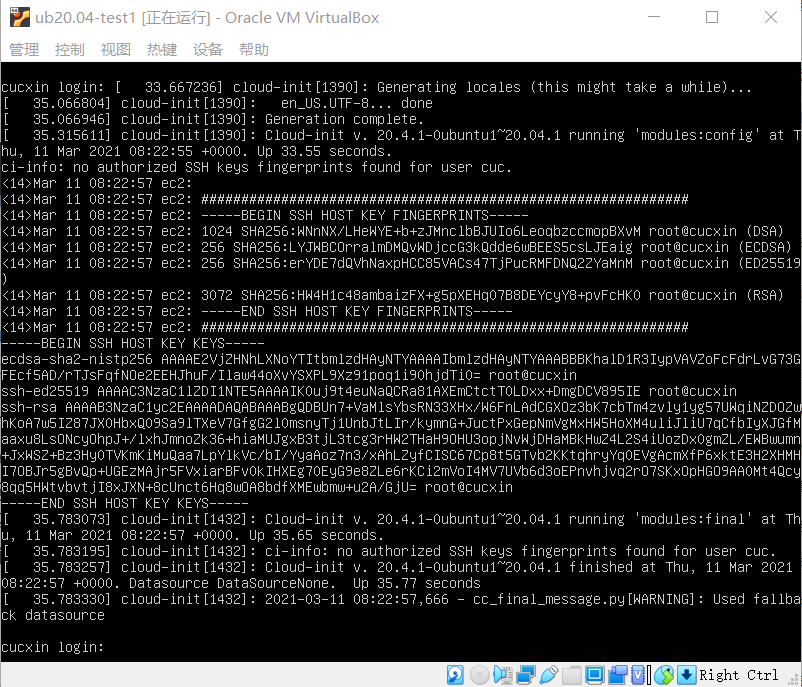

#### ②无人值守自动安装

##### 1、新建虚拟机
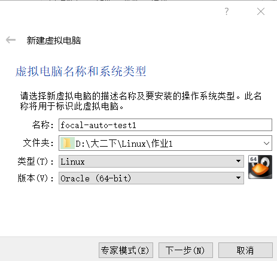

##### 2、移除控制器
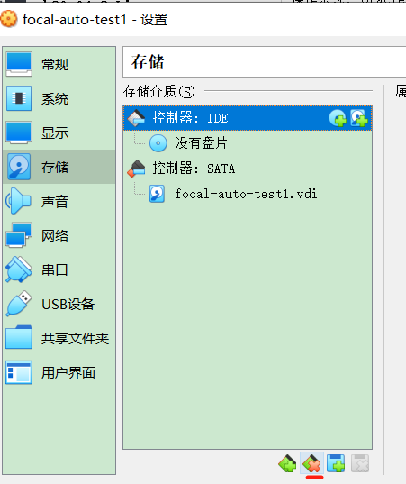

##### 3、下载好老师提供的iso文件并挂载
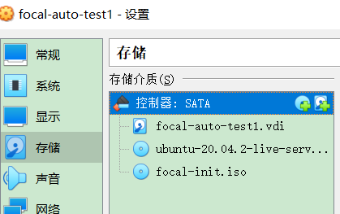

##### 4、设置好网卡，检查存储和网络设置
一块NAT，另一块Host-Only

##### 5、启动虚拟机，稍等片刻后，输入yes回车

。。。。。。经过漫长的时间
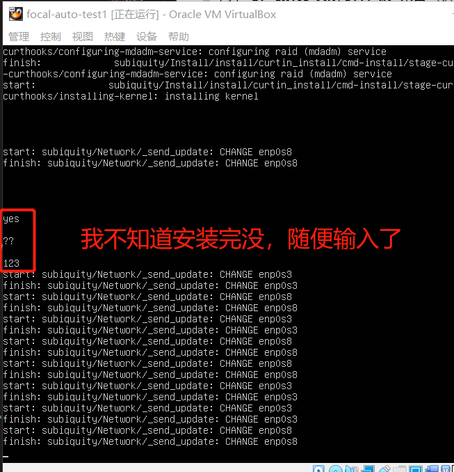
。。。。。。经过漫长的时间
终于安装完成了！
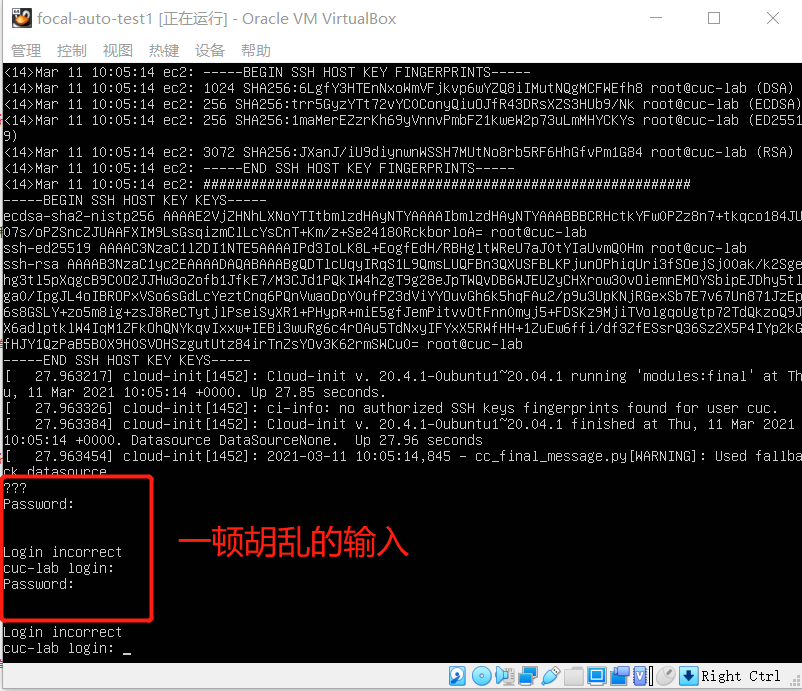

##### 6、输入用户名和密码cuc进入后，输入 ip a回车查看ip
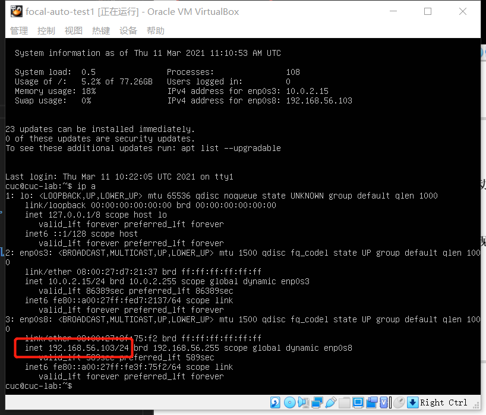

---

### 三、实验中遇到的问题以及解决方法

#### 1、github网页打不开（其他网页能正常打开）
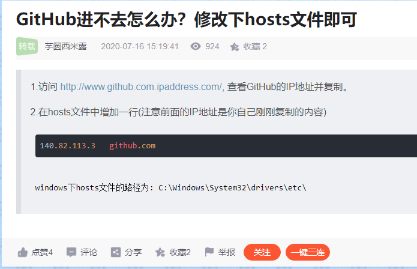

但是，修改host文件我又遇到了权限问题，我通过百度解决了
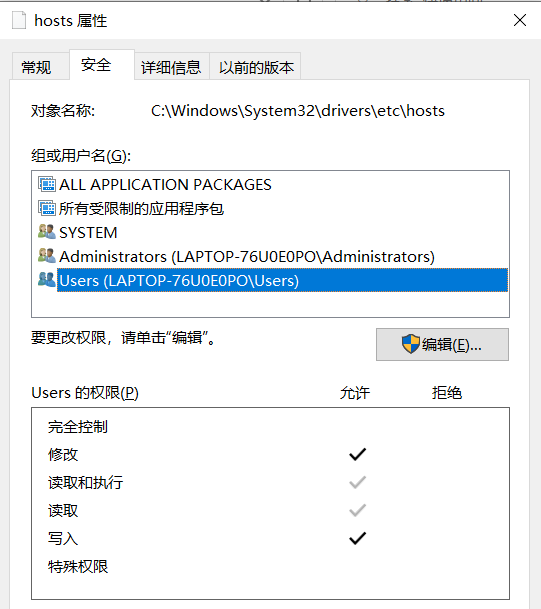
最终github能正常访问了

#### 2、手动安装过程中回车没有反应后，强制退出，损坏了虚拟机
只好重新新建一个虚拟机
其实按回车没反应只是因为没有按上下键调选项

#### 3、无法下载github上老师提供的focal-init.iso文件
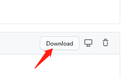

百度解决问题
CSDN链接：https://blog.csdn.net/q764424567/article/details/107375040
博客截图：
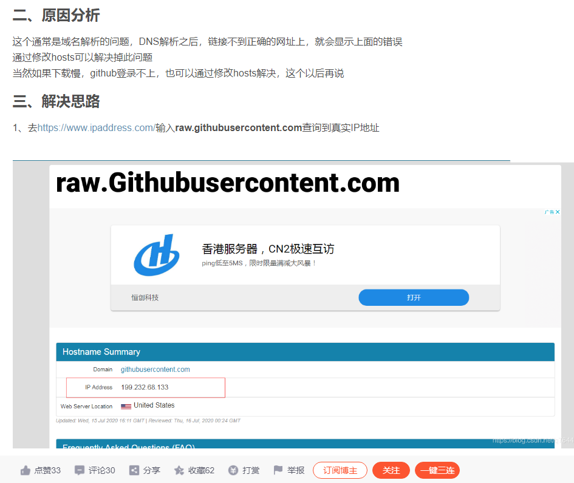
最终，我是通过修改host文件解决了问题

#### 4、我的实验中，手动安装比自动安装快，不知道为什么

---

### 四、参考资料（除了老师提供的之外）

①《Markdown基本语法》：
https://www.jianshu.com/p/191d1e21f7ed

②《GitHub进不去怎么办？修改下hosts文件即可》：
https://blog.csdn.net/qq_41117236/article/details/107383566?utm_term=github%E4%B8%BA%E4%BB%80%E4%B9%88%E8%BF%9B%E4%B8%8D%E5%8E%BB&utm_medium=distribute.pc_aggpage_search_result.none-task-blog-2~all~sobaiduweb~default-1-107383566&spm=3001.4430

③查询GitHub的IP地址：
https://github.com.ipaddress.com/www.github.com

④《解决GitHub文件无法下载的问题》：
https://blog.csdn.net/q764424567/article/details/107375040

⑤查询raw.githubusercontent.com的IP地址：
https://githubusercontent.com.ipaddress.com/raw.githubusercontent.com