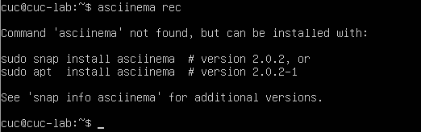
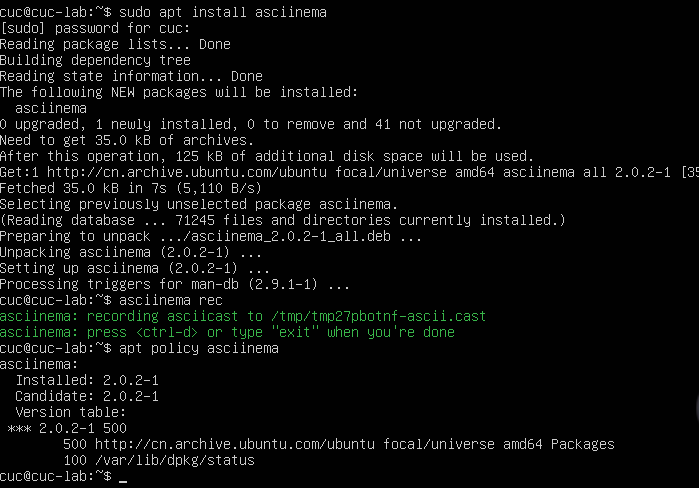
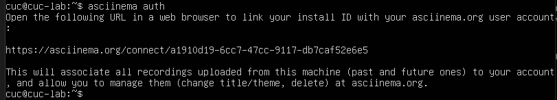
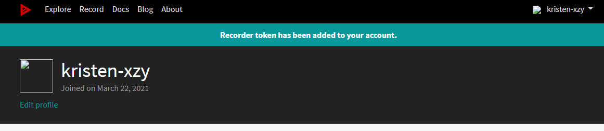
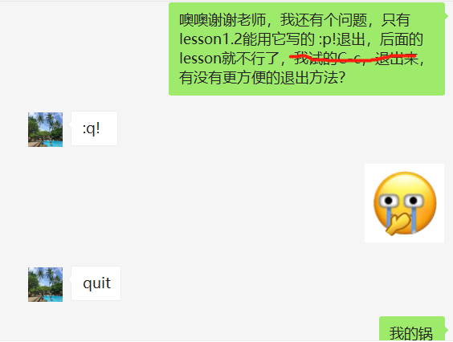
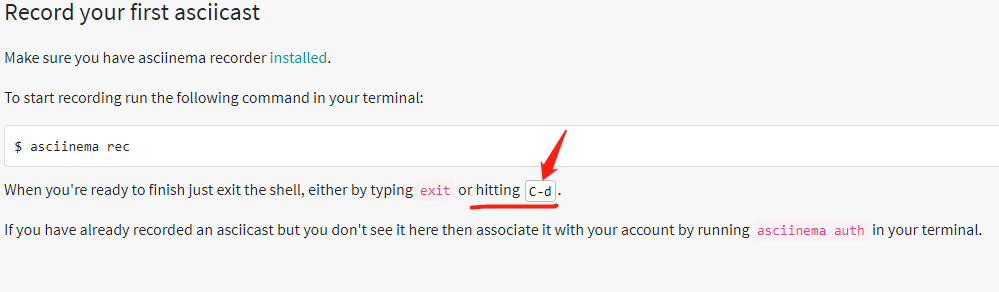
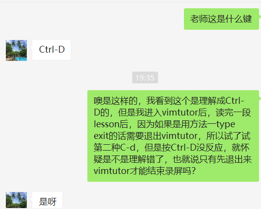

# Linux系统与网络管理-实验报告

## 实验二-Linux服务器系统使用基础

*19信息安全1班 2019302120100   辛桢杨*

---

### 一、开始实验

#### 1、在asciinema注册一个账号，并在本地安装配置好asciinema

按照提示信息，输入 sudo install asciinema，开始安装

asciinema安装成功

输入 asciinema auth，获取链接

在asciinema登录后的网站粘贴网址链接

连接成功！本地已安装配置好asciinema

#### 2、输入vimtutor打开vimtutor

每一小节lesson，用一次录屏，asciinema rec 和 exit

① Lesson1.1 && Lesson1.2:

https://asciinema.org/a/Pfp9LGfBpLqC10zdxXkttdrNJ

② Lesson1.3:

https://asciinema.org/a/kuvHjN8Pehn4PO73JTMFZSrc5

③ Lesson1.4:

https://asciinema.org/a/YDrhPFWB1auCB4iyLUMv0bRzh

④ Lesson1.5:

https://asciinema.org/a/e08qY0gnFHHw4NKmxMt4hXnV0

⑤ Lesson1.6:

https://asciinema.org/a/r70fgHrfYvJUk6phpcyapkpfr

⑥ Lesson2.1:

https://asciinema.org/a/pGrApck4eLmmalXCcksEeqrg6

⑦ Lesson2.2:

https://asciinema.org/a/Qm33toiYVHHbNtdfEEbvgpTUU

⑧ Lesson2.3:

https://asciinema.org/a/deFLPc0Ic3Ng1qDL52kqv5Yej

⑨ Lesson2.4:

https://asciinema.org/a/4qlXKy30NpXOARKJACg5Iqj9A

⑩ Lesson2.5:

https://asciinema.org/a/e9GPHpJYmGLtPyH6fr92hmFlx

⑪ Lesson2.6:

https://asciinema.org/a/iu0VSqoCGjmheVE026AVdijwN

⑫ Lesson2.7:

https://asciinema.org/a/3DXbo10OrNUy8Ek8x7P4m8oXA

⑬ Lesson3.1:

https://asciinema.org/a/WUwp03d9jdJnsevQxTv4LGbmC

⑭ Lesson3.2:

https://asciinema.org/a/RgMZKNoCTnfMqk3DuEmI3nGGS

⑮ Lesson3.3:

https://asciinema.org/a/fnu9BDltHjobU6N5hW7c4QCp8

⑯ Lesson3.4:

https://asciinema.org/a/a0MGWAiU1Guu2bwbn9QMmC5pK

⑰ Lesson4.1:

https://asciinema.org/a/xoPmbIIXu7CFESrPW6tGxYThJ

⑱ Lesson4.2:

https://asciinema.org/a/ZrwHUE06l6e9Wg7hcsHgbYHcV

⑲ Lesson4.3:

https://asciinema.org/a/Y7PkqW29wVnmBrjndUaKiClrJ

⑳ Lesson4.4:

https://asciinema.org/a/STjdoX6Epmjrjvq056HhoGOf4

(21) Lesson5.1:

https://asciinema.org/a/J7PDfsMGyvNoa3rt7Ry5axADd

(22) Lesson5.2:

https://asciinema.org/a/JAKxN4DAaV8Po9oMeMXwaO7Mi

(23) Lesson5.3:

https://asciinema.org/a/AcK5ALdNnlQw7vdNXRuNOh5GY

(24) Lesson5.4:

https://asciinema.org/a/vlDhnrAJ5kHUV2jLGjyPLsN4j

(25) Lesson6.1:

https://asciinema.org/a/WqQbMVJPcXvZmiE84On1gpxMy

(26) Lesson6.2:

https://asciinema.org/a/ip0ZQYrf59QPUy81NKm0PWc48

(27) Lesson6.3:

https://asciinema.org/a/BkXnSLthpI9sGQStATEMfOWr9

(28) Lesson6.4:

https://asciinema.org/a/rfqHesE9DKLD1KyrrSykJV4BN

(29) Lesson6.5:

https://asciinema.org/a/7rtCe48SJASCjMWmwnLB811j0

(30) Lesson7.1:

https://asciinema.org/a/tzpsDMzi7xqhrcxBIJSVfnEcw

(31) Lesson7.2:

https://asciinema.org/a/VzAz35zWle8pAents7uS27taj

(32) Lesson7.3:

https://asciinema.org/a/mSez8q0laIdSwvKaxCsvy57LG

---

### 二、自查清单

#### 1、你了解vim有哪几种工作模式？

#### 2、Normal模式下，从当前行开始，一次向下移动光标10行的操作方法？如何快速移动到文件开始行和结束行？如何快速跳转到文件中的第N行？

#### 3、Normal模式下，如何删除单个字符、单个单词、从当前光标位置一直删除到行尾、单行、当前行开始向下数N行？

#### 4、如何在vim中快速插入N个空行？如何在vim中快速输入80个-？

#### 5、如何撤销最近一次编辑操作？如何重做最近一次被撤销的操作？

#### 6、vim中如何实现剪切粘贴单个字符？单个单词？单行？如何实现相似的复制粘贴操作呢？

---

### 三、实验中遇到的问题及解决办法

#### 1、在虚拟机中鼠标一点进界面光标就消失了，无法像老师演示的那样复制命令行中的代码

本来在虚拟机中，就无法复制。老师是配置了ssh

#### 2、(错误)录屏操作中，进入vimtutor后，lesson1.2是通过typing :p!退出以便结束录屏的，而后续lesson行不通，尬录了半天。只好重新录这部分。

其实是我把p记成q了

#### 3、不懂 hitting C-d中的 C-d什么意思?其实不是

我询问了老师。

