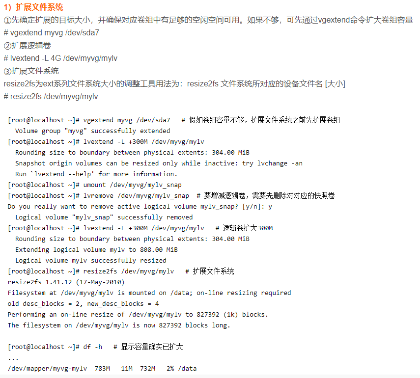
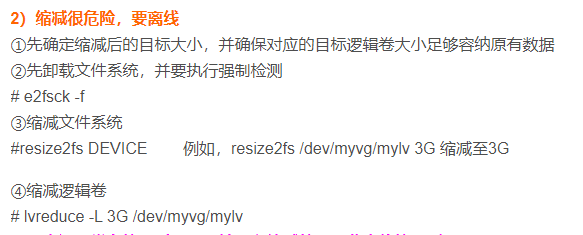
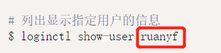
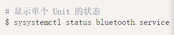
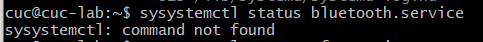

# Linux系统与网络管理-实验报告

## 实验三-Systemd入门教程

---

### 一、开始实验

#### *Ⅰ 命令篇*

##### 1、由来&概述

https://asciinema.org/a/qRgBL3XgPEpGuiI7sAMpxkWHy

##### 2、3.2systemd-analyze

https://asciinema.org/a/Ijbd5t8009r1ijcgTOtHroF7U

##### 3、3.3hostnamectl&3.4localectl

https://asciinema.org/a/7tfyF7reAtvSRdS8T0UGHIcQ5

##### 4、3.5timedatectl&3.6loginctl

https://asciinema.org/a/4MeW7TCzWBSHd1YqYpIyClwn6

##### 5、4.1含义

https://asciinema.org/a/xUr2gjLlHcAGAHD79xG4k3aa5

##### 6、4.2 Unit 的状态

https://asciinema.org/a/ZqiAgO8eugFW3FXvsVIJXqZTc

##### 7、4.3 Unit 管理

https://asciinema.org/a/4QmNGslJB8veutdJE9iSaFGTn

##### 8、4.4 依赖关系

https://asciinema.org/a/gUZvMZd6C22pahAjuUgcvnxSp

##### 9、Unit 的配置文件

https://asciinema.org/a/NMKafK3QTv4AwIAiBPK87ZNqg

##### 10、Target

https://asciinema.org/a/8UkN4AjWYq8sKP6Ble28IvPmv

##### 11、日志管理

https://asciinema.org/a/KUIqcsc1G2x0qRQlHer9pNCkY

#### *Ⅱ 实战篇*

##### 1、开机启动&启动服务&停止服务

https://asciinema.org/a/XV0xTyggIhohBlOTlWVZGeshi

##### 2、读懂配置文件

https://asciinema.org/a/MnM1aZiGpebSjffFx3Ztx5DHj

##### 3、[Install]区块

https://asciinema.org/a/C4qd5fNcf0Kf6IhiUPJczMLiW

##### 4、Target的配置文件&修改配置文件后重启

https://asciinema.org/a/FUFayuic9nPco8kUtsg3g4qZ5

---

### 二、自查清单

#### 1、如何添加一个用户并使其具备sudo执行程序的权限？

```sudo adduser newusr```

```sudo usermod -G sudo -a newusr```

#### 2、如何将一个用户添加到一个用户组？

```sudo useradd -G {group-name} username```

#### 3、如何查看当前系统的分区表和文件系统详细信息？

```df -T -h```
```sudo fdisk -l```

#### 4、如何实现开机自动挂载Virtualbox的共享目录分区？

在文件 ```/etc/rc.local``` 中（用root用户）追加如下命令 ```mount -t vboxsf java /mnt/share```

#### 5、基于LVM（逻辑分卷管理）的分区如何实现动态扩容和缩减容量？





#### 6、如何通过systemd设置实现在网络连通时运行一个指定脚本，在网络断开时运行另一个脚本？

修改systemd-networkd中的Service ExecStartPost=网络联通时运行的指定脚本 ExecStopPost=网络断开时运行的另一个脚本

#### 7、如何通过systemd设置实现一个脚本在任何情况下被杀死之后会立即重新启动？实现杀不死？

```sudo systemctl vi scriptname Restart = always sudo systemctl daemon-reload```

---

### 三、实验中遇到的问题及解决办法

#### 1、照着网页上的代码直接输入，没有思考

①应该输入自己的用户名 cuc




②sysystemctl应该是作者笔误





#### 2、网页中的例子的 xxx.service不可用

比如 ```bluetooth.service```、```httpd.service```

我尝试在网上搜索如何下载安装httpd，但是失败，我询问同学，同学告诉我用```ufw.service```代替
