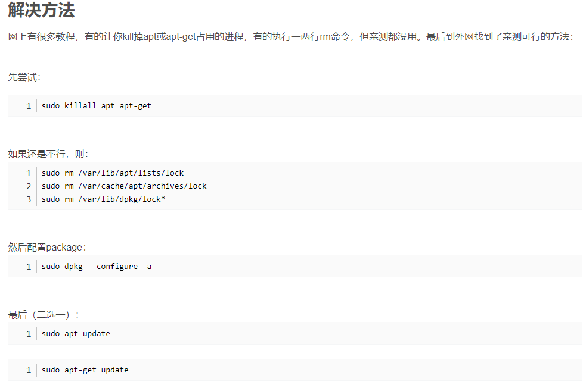

# Linux系统与网络管理-实验报告

## 实验四-shell脚本编程基础

---

### 一、实验要求

#### 任务一：用bash编写一个图片批处理脚本，实现以下功能：
* [x] 支持命令行参数方式使用不同功能
* [x] 支持对指定目录下所有支持格式的图片文件进行批处理
* [x] 支持以下常见图片批处理功能的单独使用或组合使用
* [x] 支持对jpeg格式图片进行图片质量压缩
* [x] 支持对jpeg/png/svg格式图片在保持原始宽高比的前提下压缩分辨率
* [x] 支持对图片批量添加自定义文本水印
* [x] 支持批量重命名（统一添加文件名前缀或后缀，不影响原始文件扩展名）
* [x] 支持将png/svg图片统一转换为jpg格式图片

#### 任务二：用bash编写一个文本批处理脚本，对以下附件分别进行批量处理完成相应的数据统计任务：
* [x] 2014世界杯运动员数据
* [x] 统计不同年龄区间范围（20岁以下、[20-30]、30岁以上）的球员数量、百分比
* [x] 统计不同场上位置的球员数量、百分比
* [x] 名字最长的球员是谁？名字最短的球员是谁？
* [x] 年龄最大的球员是谁？年龄最小的球员是谁？

#### 任务三：用bash编写一个文本批处理脚本，对以下附件分别进行批量处理完成相应的数据统计任务：
* [x] Web服务器访问日志
* [x] 统计访问来源主机TOP 100和分别对应出现的总次数
* [x] 统计访问来源主机TOP 100 IP和分别对应出现的总次数
* [x] 统计最频繁被访问的URL TOP 100
* [x] 统计不同响应状态码的出现次数和对应百分比
* [x] 分别统计不同4XX状态码对应的TOP 10 URL和对应出现的总次数
* [x] 给定URL输出TOP 100访问来源主机

### 二、实验过程

#### 1、安装插件


#### 2、安装```imagemagick```

```sudo apt-get update```

```sudo apt-get install imagemagick```

#### 3、根据要求写程序代码

(具体代码见shell文件)

##### ①任务一：

导入一张jpeg图片到vscode中，我导入的原图```Jay.jpeg```是


运行示例及结果：


运行后新生成的图```xzyJayxzy.jpeg```是


##### ②任务二：

运行示例及结果：


##### ③任务三：

运行示例及结果（较长）：


### 三、老师上课视频中的课内练习

* 求2个数的最大公约数

```
#!/bin/sh
read -p "Input two positive integers: " a b
# Greatest Common Divisor
gcd()
{
   if [ $2 -eq 0 ]; then
      echo $1
   else
      gcd $2 `expr $1 % $2`
   fi  
}
gcd $a $b
```

### 四、实验中遇到的问题及解决办法

#### 1、安装```imagemagick```失败


解决办法(CSDN文章)：



原因：

* 某些apt命令正在终端里运行还未结束

* 某些apt进程正在运行

#### 2、任务二中求players的最长名字和最短名字出错


写错的代码：

```
function mostName {
    awk -F "\t" 'BEGIN{
        short=10000;long=0} $1!="Group"{
        l=length($6);  //这里写错了，应该是$9
        name[$6]=l;    //这里写错了，应该是$9
        if(l>long) long = l;
        if(l<short) short=l;
    }END{
        for(i in name) {
                if(name[i]==long) printf("The longest name is %s\n", i);
                if(name[i]==short) printf("The shortest name is %s\n", i);               
    }
    }' worldcupplayerinfo.tsv
}
```

错误原因：\$9写成了\$6，\$9是名字，l是名字对应的长度

### 五、参考资料

* 上届前辈的实验：https://github.com/CUCCS/linux-2020-LyuLumos/tree/ch0x04/ch0x04

* 四中问题1的CSDN文章(截图见上)：https://blog.csdn.net/weixin_44765402/article/details/109926221

* awk的正则表达式：https://www.cnblogs.com/DengGao/p/5935719.html


* 感觉写程序代码难度不小，询问了同学，得到了帮助解答